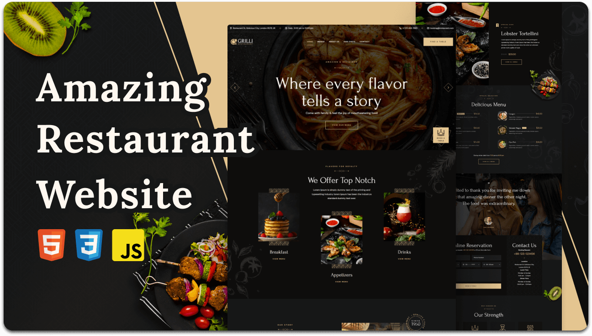
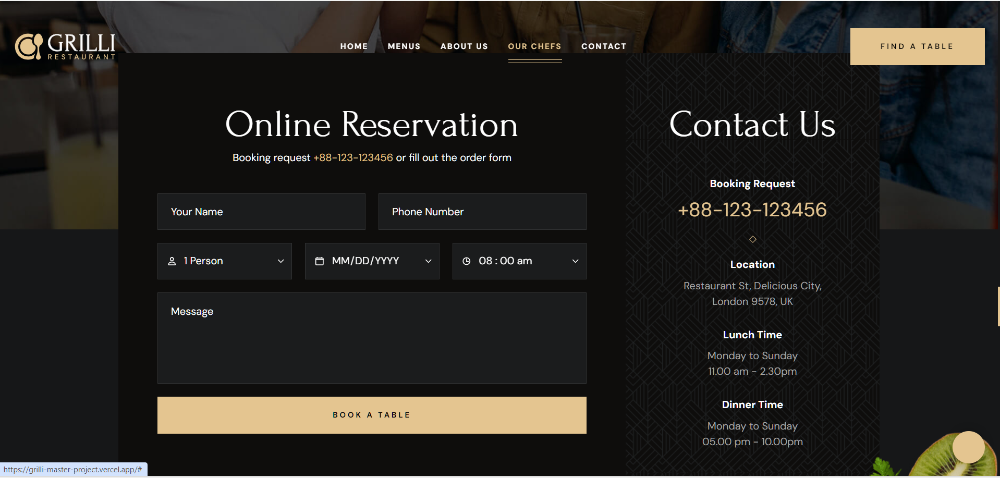

# Grilli Restaurant Website 🍽️

*A modern and elegant restaurant landing page built with HTML, CSS, and JavaScript, focused on delivering a premium user experience through responsive layouts, smooth interactions, and visually appealing design.*
*The project was developed to simulate a real-world restaurant website with attention to UI consistency, clean structure, and responsive behavior across different screen sizes.*

## Live Demo 🚀
https://grilli-master-project.vercel.app/

## Features ✨
* Fully responsive design for mobile, tablet, and desktop devices.
* Modern restaurant-inspired UI with clean visual hierarchy.
* Smooth scrolling and interactive navigation experience.
* Elegant typography and balanced spacing system.
* Organized sections for menu, services, about, and reservation.
* Reusable CSS utility classes and scalable styling structure.
* Optimized layout structure for improved readability and user experience.

## Design Philosophy 🎨

The UI was designed to create a luxurious and welcoming restaurant atmosphere through balanced spacing, elegant typography, warm colors, and smooth visual flow between sections.
Special attention was given to responsiveness and content organization to maintain a consistent experience across all devices.

## Responsive Design 📱
The layout was built with a mobile-first mindset to ensure adaptability across different screen sizes.  
Flexbox and CSS Grid were used to create flexible layouts that maintain visual consistency and usability on both small and large devices . 
Typography, spacing, and section alignment were carefully adjusted to improve readability and overall user experience . 

## Technologies Used 🧠
* HTML5 for semantic and accessible page structure.
* CSS3 for styling, layouts, animations, and responsive behavior.
* JavaScript (ES6+) for interactivity and dynamic UI behavior.
* Flexbox and CSS Grid for modern layout systems.
* Responsive Design principles for cross-device compatibility.

## Project Structure ⚙️
Organized project structure focused on scalability and maintainability. 
Separated styling, assets, and JavaScript logic into clear sections for easier development and future improvements. 
Reusable classes and structured layouts were used to reduce redundancy and improve consistency. 

## screenshots 

## Project Preview 🎥
[Watch Full Demo Video](./assets/preview/grilli-demo.mp4)

## What I Learned 🎯
* Building responsive layouts for complex multi-section pages.
* Creating reusable UI patterns and utility classes.
* Improving visual hierarchy and section organization.
* Managing spacing systems and responsive typography.
* Structuring scalable frontend projects more effectively.
* Improving frontend workflow and project organization practices.

## Future Improvements 🚀
* Add backend reservation functionality.
* Improve accessibility and keyboard navigation.
* Add smoother animations and transitions.
* Optimize image loading and overall performance.
* Implement dark mode support.
* Integrate dynamic menu filtering functionality.

## Author 👨‍💻
Built by a Frontend Developer focused on creating responsive, user-centered web experiences with modern UI design and scalable frontend architecture.

## License
This project is licensed under the [MIT License](https://choosealicense.com/) - see the [LICENSE.md](LICENSE) file for details.